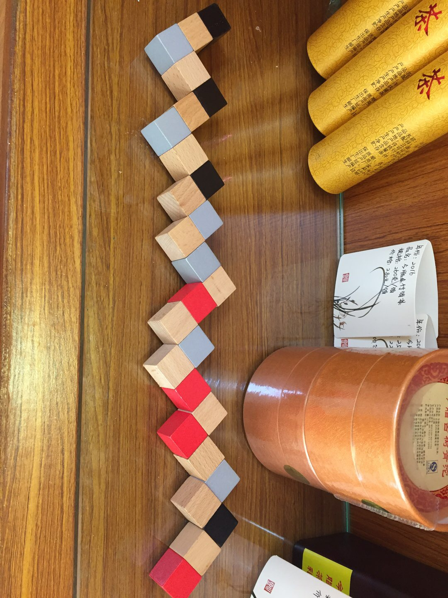

# magic-cube-block
一个魔方积木的还原算法

魔方积木如图：



说明：需要通过转动拼成3*3的立方体，接口处可以转动。

```
# 运行
python3 cube.py

# 共有两种不同的解法
# 输出结果如下：
**************************************** 1
(0, 0, 0) -> z+2 -> [(0, 0, 1), (0, 0, 2)]
(0, 0, 2) -> x+2 -> [(1, 0, 2), (2, 0, 2)]
(2, 0, 2) -> z-2 -> [(2, 0, 1), (2, 0, 0)]
(2, 0, 0) -> y+2 -> [(2, 1, 0), (2, 2, 0)]
(2, 2, 0) -> z+1 -> [(2, 2, 1)]
(2, 2, 1) -> y-1 -> [(2, 1, 1)]
(2, 1, 1) -> z+1 -> [(2, 1, 2)]
(2, 1, 2) -> x-2 -> [(1, 1, 2), (0, 1, 2)]
(0, 1, 2) -> z-2 -> [(0, 1, 1), (0, 1, 0)]
(0, 1, 0) -> y+1 -> [(0, 2, 0)]
(0, 2, 0) -> x+1 -> [(1, 2, 0)]
(1, 2, 0) -> y-2 -> [(1, 1, 0), (1, 0, 0)]
(1, 0, 0) -> z+1 -> [(1, 0, 1)]
(1, 0, 1) -> y+2 -> [(1, 1, 1), (1, 2, 1)]
(1, 2, 1) -> x-1 -> [(0, 2, 1)]
(0, 2, 1) -> z+1 -> [(0, 2, 2)]
(0, 2, 2) -> x+2 -> [(1, 2, 2), (2, 2, 2)]
**************************************** 2
(0, 0, 0) -> z+2 -> [(0, 0, 1), (0, 0, 2)]
(0, 0, 2) -> y+2 -> [(0, 1, 2), (0, 2, 2)]
(0, 2, 2) -> z-2 -> [(0, 2, 1), (0, 2, 0)]
(0, 2, 0) -> x+2 -> [(1, 2, 0), (2, 2, 0)]
(2, 2, 0) -> z+1 -> [(2, 2, 1)]
(2, 2, 1) -> x-1 -> [(1, 2, 1)]
(1, 2, 1) -> z+1 -> [(1, 2, 2)]
(1, 2, 2) -> y-2 -> [(1, 1, 2), (1, 0, 2)]
(1, 0, 2) -> z-2 -> [(1, 0, 1), (1, 0, 0)]
(1, 0, 0) -> x+1 -> [(2, 0, 0)]
(2, 0, 0) -> y+1 -> [(2, 1, 0)]
(2, 1, 0) -> x-2 -> [(1, 1, 0), (0, 1, 0)]
(0, 1, 0) -> z+1 -> [(0, 1, 1)]
(0, 1, 1) -> x+2 -> [(1, 1, 1), (2, 1, 1)]
(2, 1, 1) -> y-1 -> [(2, 0, 1)]
(2, 0, 1) -> z+1 -> [(2, 0, 2)]
(2, 0, 2) -> y+2 -> [(2, 1, 2), (2, 2, 2)]
```

说明：

`(0, 0, 0) -> z+2 -> [(0, 0, 1), (0, 0, 2)]`这个的意思是，当前的起点坐标为`(0,0,0)`，做操作`z+2`（z轴增加2，说明边长为3的就是增加2），即边`(0,0,0)->(0,0,2)`，可以理解为将该边进行染色，被染色的点为`[(0, 0, 1), (0, 0, 2)]`

原点`(0, 0, 0)`初始状态就已经染色了。
